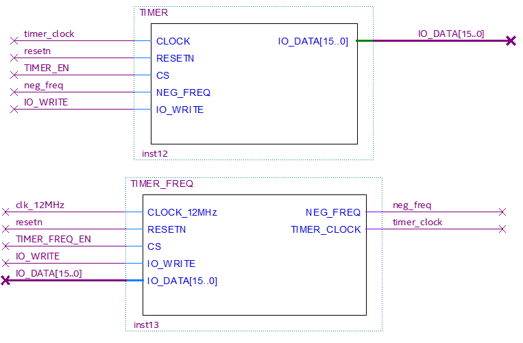
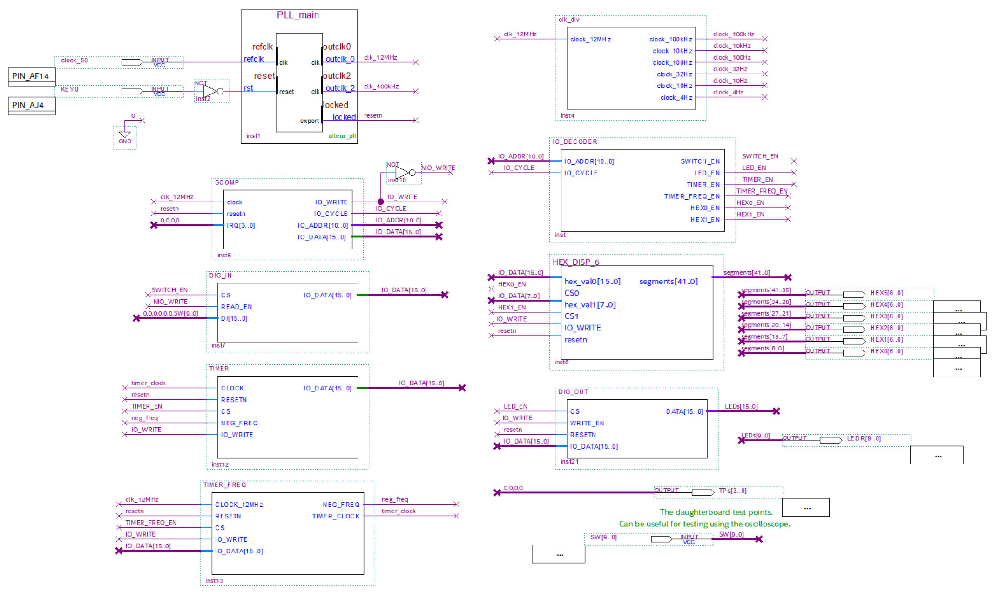

# ECE 2031 Final Project

## SCOMP Timer Peripheral with Expanded Functionality

This project implements an advanced SCOMP (Simple Computer Peripheral) timer with two key components: TIMER and TIMER_FREQ. Each component has its own chip select address, allowing users to interact with both timer and frequency settings through direct I/O instructions. <br>
**Features**
- **Direct I/O Control**: Using `IN` and `OUT` instructions, users can set or retrieve:
    - **Timer Count**: Get the current timer count, or reset it.
    - **Timer Frequency**: Set frequency, including counting up or down.

- **Chip Select Addresses**:
    - `0x2` for **TIMER**
    - `0x3` for **TIMER_FREQ**

- **Enhanced Functionality**: This implementation builds on the original SCOMP timer, which was limited to counting up at a fixed rate of 0.1 seconds. Now, users have the flexibility to adjust frequency and control count direction (up or down).

This peripheral extends the capabilities of the SCOMP architecture, adding more control and flexibility to timer operations for various applications.

## Timer Functionality Added:

1. TIMER peripheral
    - Stores current counter value
    - Does the counting
2. TIMER_FREQ peripheral
    - Provides user-specified timer speed in Hz

## TIMER BDF Structure:



## VHDL Organization:

The TIMER and TIMER_FREQ are currently in separate vhdl files, but it is possible to merge them together into a single vhdl file, and have two Chip Select inputs to differ between the two. <br>
The peripherals are separated for now for debugging simplicity.

## Assembly Code Example:
```asm
; TIMER_TEST.asm
; ----------------------------------------------------------
; TIMER_FREQ control the clock speed going to the clock
;       ACC = Freq (Neg, Zero, Pos)
;       If ACC = 0, then stop timer
;       Else if ACC = POS, then count up
;       Else if ACC = NEG, then count down
; TIMER stores the counter and does the counting
;       ACC = Starting Value
; ----------------------------------------------------------
; OUT TIMER : Sets Timer counter
; IN TIMER : Gets Timer counter
; OUT TIMER_FREQ : Sets Timer frequency (Hz)
; IN TIMER_FREQ : Gets Timer frequency (Hz)
; ----------------------------------------------------------

ORG 0
    ; Stop timer and set counter = 0
    LOADI   0
    OUT     TIMER_FREQ
    OUT     TIMER

    ; Start timer with 2 Hz and count until 10
    LOADI   2
    OUT     TIMER_FREQ
    CALL    COUNT_UP

    ; Stop timer
    LOADI   0
    OUT     TIMER_FREQ

    ; Set counter = 10 and start timer with -2 Hz
    LOADI   10
    OUT     TIMER
    LOADI   -2
    OUT     TIMER_FREQ
    CALL    COUNT_DOWN

	JUMP    0

COUNT_UP:
    IN      TIMER
    OUT     Hex1
    SUB     LIMIT
    JNEG    COUNT_UP
    RETURN

COUNT_DOWN:
    IN      TIMER_FREQ
    OUT     Hex1
    JPOS    COUNT_DOWN
    RETURN

; Values
LIMIT:      DW  10

; IO address constants
Switches:   EQU 000
LEDs:       EQU 001
TIMER:      EQU 002
TIMER_FREQ: EQU 003
Hex0:       EQU 004
Hex1:       EQU 005
```

## Code in Action


## Overall SCOMP_System BDF structure:



